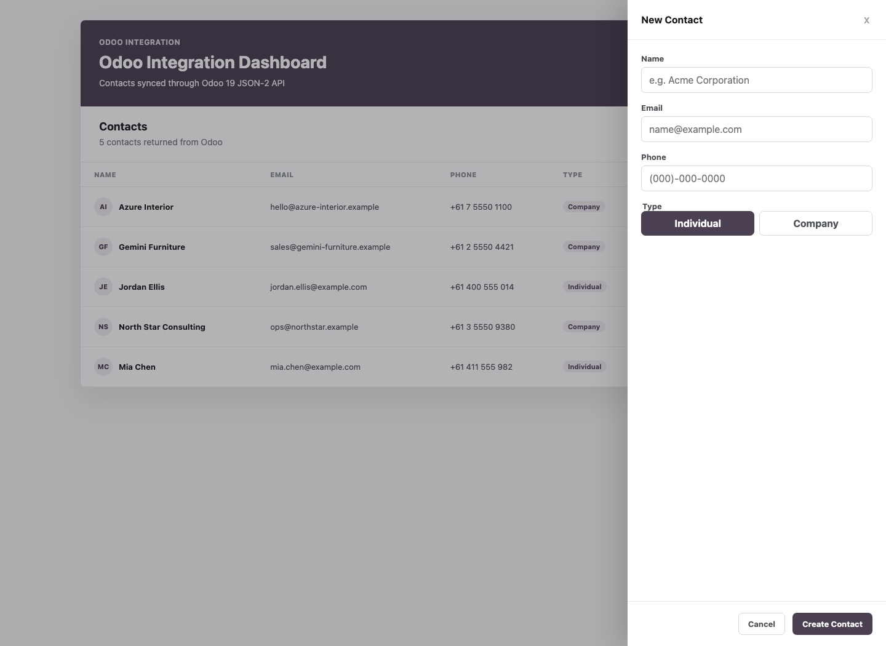

# Odoo Integration Demo

Small full-stack integration project for learning and demonstrating the Odoo 19 JSON-2 API. Odoo remains the system of record; the app provides a Node/Express integration API and a compact React frontend for contact workflows.

## Architecture

The application has three clear boundaries:

- `client/`: React and TypeScript UI. It renders contacts and submits form data to the integration API.
- `server/`: Node/Express API. It validates requests, holds the Odoo API key in server-side environment variables, and calls Odoo.
- Odoo/PostgreSQL: Odoo is the system of record for `res.partner` contacts.

```text
      +---------------------+
      | React / TypeScript  |
      | client              |
      +----------+----------+
           | HTTP: /health, /api/contacts
           v
      +---------------------+
      | Node / Express      |
      | integration API     |
      +----------+----------+
           | Odoo JSON-2 with API-key auth
           v
      +---------------------+
      | Odoo 19             |
      | res.partner         |
      +----------+----------+
           v
      +---------------------+
      | PostgreSQL          |
      +---------------------+
```

The frontend never receives the Odoo API key or database credentials. Browser requests go to the Node API, and the Node API talks to Odoo.

## Request Flow

Listing contacts:

```text
React contact table
  -> GET /api/contacts
  -> Express contacts route
  -> Odoo JSON-2 res.partner search_read
  -> normalized JSON response
  -> React loading/error/empty/table state
```

Creating or editing contacts:

```text
React form
  -> client-side required-name/email checks
  -> POST /api/contacts or PATCH /api/contacts/:id
  -> Express validation
  -> Odoo JSON-2 res.partner create/write
  -> refresh contact list from Odoo
  -> synced status shown in the UI
```

The UI does not maintain its own contact database. After successful writes, it reloads contacts through the backend so the table reflects Odoo-backed data.

## Screenshots




## Local Setup

### Prerequisites

- Node.js 18 or newer, for the built-in `fetch` API.
- Docker Compose.
- A local Odoo 19 database named `odoo_dev`.
- An Odoo API key with access to `res.partner`.

### Environment

Create `server/.env` from `server/.env.example`:

```env
ODOO_URL=http://localhost:8069
ODOO_DATABASE=odoo_dev
ODOO_API_KEY=replace_with_api_key
PORT=3001
```

Never commit real API keys. The root `.gitignore` excludes local `.env` files.

The client uses the Vite dev-server proxy by default. If you need to point the browser at a separately hosted API, create `client/.env` with:

```env
VITE_API_BASE_URL=http://localhost:3001
```

### Run Locally

1. Start Odoo and PostgreSQL from the repository root:

```sh
docker compose up -d
```

2. Start the backend:

```sh
cd server
npm install
npm run dev
```

The backend defaults to `http://localhost:3001`.

3. Start the frontend:

```sh
cd client
npm install
npm run dev
```

The frontend runs at `http://localhost:5173` and proxies `/api` and `/health` to the backend during local development.

Run backend tests:

```sh
cd server
npm test
```

Run frontend tests:

```sh
cd client
npm test
```

## Endpoints

- `GET /health`
- `GET /api/contacts?limit=5`
- `POST /api/contacts`
- `PATCH /api/contacts/:id`

## API Examples

Health check:

```sh
curl http://localhost:3001/health
```

List contacts:

```sh
curl "http://localhost:3001/api/contacts?limit=5"
```

Create a contact:

```sh
curl http://localhost:3001/api/contacts \
  -X POST \
  -H "Content-Type: application/json" \
  -d '{
    "name": "Integration Test Contact",
    "email": "integration.test@example.com",
    "phone": "0400000000",
    "is_company": false
  }'
```

Update a contact:

```sh
curl http://localhost:3001/api/contacts/123 \
  -X PATCH \
  -H "Content-Type: application/json" \
  -d '{
    "phone": "0400000001"
  }'
```

The backend forwards validated contact operations to Odoo's `res.partner` model using `/json/2/res.partner/search_read`, `/json/2/res.partner/create`, and `/json/2/res.partner/write`.

## Current Features

- List Odoo contacts.
- Create Odoo contacts.
- Edit Odoo contacts.
- Show loading, empty, success, and error states.
- Display Odoo record ids and synced status.

## What I Learned

- How to call the Odoo 19 JSON-2 API from a small Node integration layer.
- How Odoo stores contacts and companies in the `res.partner` model.
- How to keep API-key authentication server-side instead of exposing credentials to the browser.
- Why Odoo should remain the system of record, with the frontend refreshing data from Odoo after writes.
- How to map validation, network, and Odoo failures into useful API and UI error messages.

## Non-Goals

This is intentionally a small integration demonstration, not a replacement CRM or ERP. It does not include authentication, deletion, products, invoices, analytics, background jobs, or a separate local database.
