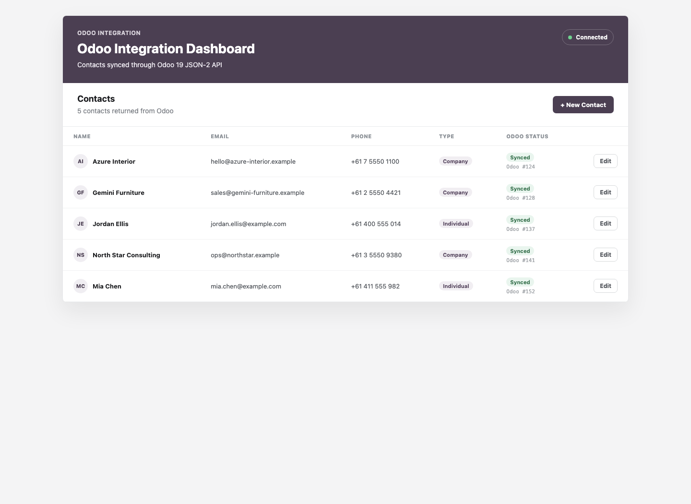

# Odoo Integration Backend

This first iteration is a small Node/Express REST API that reads and writes Odoo contacts through the Odoo 19 JSON-2 API. Odoo remains the system of record; this service only validates incoming requests, calls Odoo, and returns clean API responses.

## Prerequisites

- Node.js 18 or newer, for the built-in `fetch` API.
- Docker Compose.
- A local Odoo 19 database named `odoo_dev`.
- An Odoo API key with access to `res.partner`.

## Environment

Create `server/.env` from `server/.env.example`:

```env
ODOO_URL=http://localhost:8069
ODOO_DATABASE=odoo_dev
ODOO_API_KEY=replace_with_api_key
PORT=3001
```

Never commit real API keys. `server/.gitignore` excludes `.env`.

## Run Locally

From the repository root, start Odoo and PostgreSQL:

```sh
docker compose up -d
```

Then start the backend:

```sh
cd server
npm install
npm run dev
```

Run tests:

```sh
npm test
```

## Screenshots

The React client uses this backend to list contacts from Odoo and submit contact changes back through the integration API.




## Endpoints

- `GET /health`
- `GET /api/contacts?limit=5`
- `POST /api/contacts`
- `PATCH /api/contacts/:id`

## Examples

Health check:

```sh
curl http://localhost:3001/health
```

List contacts:

```sh
curl "http://localhost:3001/api/contacts?limit=5"
```

Create a contact:

```sh
curl http://localhost:3001/api/contacts \
  -X POST \
  -H "Content-Type: application/json" \
  -d '{
    "name": "Integration Test Contact",
    "email": "integration.test@example.com",
    "phone": "0400000000",
    "is_company": false
  }'
```

Update a contact:

```sh
curl http://localhost:3001/api/contacts/123 \
  -X PATCH \
  -H "Content-Type: application/json" \
  -d '{
    "phone": "0400000001"
  }'
```

The backend forwards validated contact operations to Odoo's `res.partner` model using `/json/2/res.partner/search_read`, `/json/2/res.partner/create`, and `/json/2/res.partner/write`.
